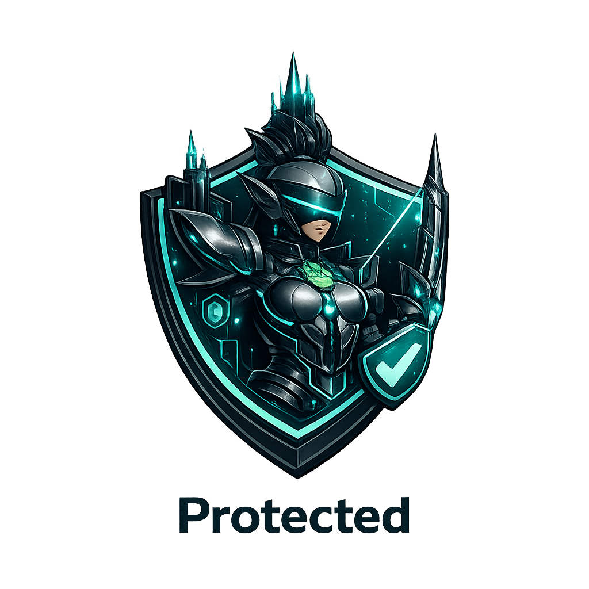
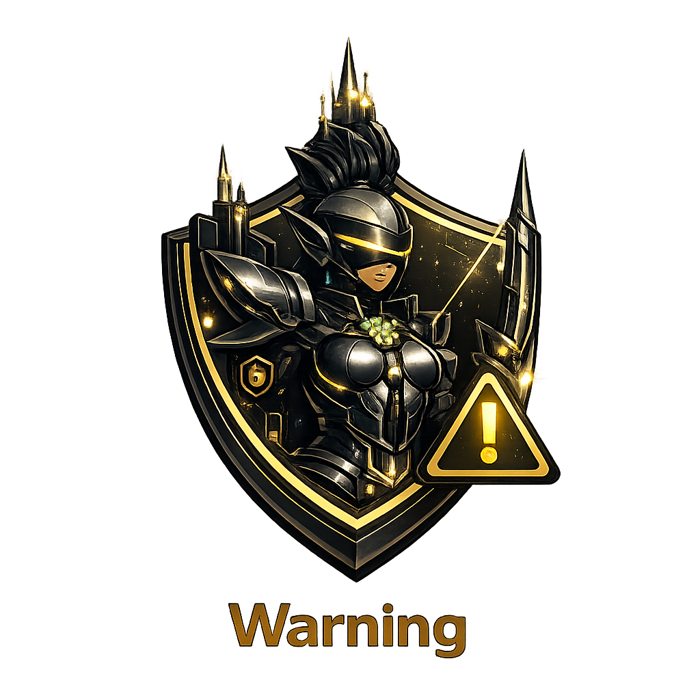

# NetSentry

Plugin-driven Telegram interface to MikroTik routers, designed to run on a Raspberry Pi.

<div align="center">
  
  <br>
  
</div>

## Overview

NetSentry exposes a MikroTik router through a Telegram bot. Each capability — guest WiFi rotation, traffic reports, health monitoring, security alerts, YouTube bookmark summarisation, GitHub repo analysis — lives in its own plugin file. Secrets live in a Fernet-encrypted vault. The whole system runs as a single systemd service. It replaces the stack of ad-hoc scripts and cron entries that home-lab users tend to accumulate.

## Features

- 16 Telegram commands covering router status, client lists, WAN health, Pi-hole stats, log inspection, on-demand speedtests, and guest password rotation with QR delivery.
- Inline-keyboard interactions: `/kick` opens a per-client button picker, then a disconnect-once or permanent-block confirmation.
- Scheduled automations: weekly guest password rotation, weekly router config backup with rotation, weekly WiFi neighbour scan, daily traffic report at 21:00, morning briefing at 08:00.
- Real-time alerts on new WiFi clients, brute-force login attempts, internet outage recovery, unscheduled router reboot, and low router disk.
- Encrypted credentials vault using Fernet (AES-128-CBC + HMAC); master key kept mode 400, ciphertext mode 600.
- Save-and-export workflow: `youtube_bookmarks` saves URLs with metadata and, on demand, ships the transcript as a `.txt` Telegram document; `github_explorer` shallow-clones repos and exports a Markdown bundle (README + manifests + file tree) as a Telegram document. Paste either into ChatGPT or any external tool yourself.
- Visual state language: every alert ships with one of five canonical state PNGs, attached automatically by `notifier.send_state(state, text)`.
- One plugin = one file in `src/netsentry/plugins/`. Adding a new feature does not touch core code. Router and notifier are abstract interfaces; adding OpenWrt or Discord is a subclass.

## Visual states

Alerts attach one of five icons so the operator reads them at a glance:

<div align="center">

| Protected | Scanning | Warning | Attack | Offline |
|:---:|:---:|:---:|:---:|:---:|
|  |  |  |  |  |
| All clear | Active task | Attention | Threat | Unreachable |

</div>

Plugins call `self.notifier.send_state("warning", "...")` and the matching icon ships with the message. The PNGs are bundled inside the wheel; if a file is unreadable the call falls back to plain text.

## Architecture

NetSentry has three layers in use plus one planned. The runtime loads plugins from `src/netsentry/plugins/`, wires each with a `PluginContext` holding the abstract `Router`, `Notifier`, `AIClient`, `Vault`, `Scheduler`, and `EventBus`, then hands control to the `telegram_bot` plugin's long-poll loop. Plugins talk only to the abstract interfaces, so swapping MikroTik for OpenWrt or Telegram for Discord requires no plugin changes.

### Components

| Component | Role |
|---|---|
| `core.runtime.Runtime` | Loads config, builds router/notifier/AI/vault, discovers plugins, runs the bot |
| `core.router.Router` | Abstract router interface; `MikroTikRouter` implements via SSH key-auth |
| `core.notifier.Notifier` | Abstract notification channel; `TelegramNotifier` implemented; `send_state()` attaches state icons |
| `core.ai.AIClient` | Abstract LLM client; `OllamaClient` talks HTTP to a remote Ollama with availability probe |
| `core.vault.Vault` | Fernet-encrypted key/value store at `~/.config/netsentry/secrets.{key,enc}` |
| `core.config.Config` | YAML loader; expands `${vault:KEY}` and `${env:KEY}` placeholders at load time |
| `core.scheduler.Scheduler` | APScheduler wrapper, standard 5-field cron expressions |
| `core.events.EventBus` | In-process pub/sub between plugins |
| `core.plugin.Plugin` | Base class with hooks `on_load`, `on_command`, `on_callback`, `on_event`, `scheduled_tasks` |
| `plugins.telegram_bot` | Long-poll loop; discovers every plugin's `COMMANDS` and registers the Telegram slash menu via `setMyCommands` |
| `plugins.guest_wifi_rotator` | `/rotate`, `/guest`; PSK rotation and QR delivery |
| `plugins.health_monitor` | Internet, uptime, disk, brute-force, new-client checks every 5 minutes |
| `plugins.lan_scanner` | `/lan` inventory + MAC tagging; pulls ARP/DHCP/WiFi tables, persists tags, integrates with new-client alerts |
| `plugins.youtube_bookmarks` | `/yt` save/list/get/show/watched/tag/search/remind/delete/export; transcripts as `.txt` Telegram document; no AI |
| `plugins.github_explorer` | `/gh` clone shallow + Markdown bundle (README + manifests + tree) as `.md` Telegram document; no AI |
| Single-purpose plugins | `router_info`, `pihole_stats`, `speedtest`, `security_actions`, `traffic_report`, `channel_scan`, `config_backup`, `morning_briefing` |

## Tech Stack

| Technology | Role |
|---|---|
| Python 3.11+ | Runtime |
| Hatchling | Build backend |
| Click | CLI |
| PyYAML | Configuration |
| cryptography (Fernet) | Encrypted secrets vault |
| APScheduler | In-process cron scheduling |
| qrcode[pil] | QR generation for guest WiFi |
| Telegram Bot API | Notification channel and command surface |
| Ollama | Local LLM backend used by `youtube_bookmarks` and `github_explorer` |
| MikroTik RouterOS v7+ | Target router platform, SSH key-auth |
| yt-dlp | YouTube metadata and transcript extraction |
| sqlite3 | Pi-hole FTL database queries |
| speedtest-cli, vnstat | Network measurement |

## Installation

System packages on Debian / Raspberry Pi OS:

```bash
sudo apt install python3 python3-pip python3-cryptography python3-yaml \
                 python3-apscheduler python3-click python3-qrcode sqlite3 \
                 qrencode speedtest-cli vnstat yt-dlp git
```

NetSentry itself:

```bash
git clone https://github.com/wannabexaker/NetSentry.git
cd NetSentry
pip install -e .

netsentry init
netsentry secret set TELEGRAM_TOKEN <bot-token>
netsentry secret set TELEGRAM_CHAT_ID <chat-id>
netsentry secret set ALLOWED_CHAT_ID <chat-id>
netsentry secret set ROUTER_HOST 192.168.1.1
netsentry secret set ROUTER_USER netsentry
netsentry secret set SSH_KEY ~/.ssh/netsentry-router-key
# optional, only if youtube_bookmarks or github_explorer are enabled
netsentry secret set OLLAMA_HOST <workstation-tailscale-ip>
```

Service install:

```bash
sudo sed "s/__USER__/$(id -un)/g" deploy/netsentry.service \
  | sudo tee /etc/systemd/system/netsentry.service > /dev/null
sudo systemctl daemon-reload
sudo systemctl enable --now netsentry
```

Step-by-step deployment, including the MikroTik-side SSH key setup, is in `docs/INSTALL.md`.

## Usage

Foreground run for testing:

```bash
netsentry start
```

Vault operations:

```bash
netsentry secret list
netsentry secret set <KEY> <value>
netsentry secret rotate-key
```

Service control:

```bash
sudo systemctl restart netsentry
sudo journalctl -u netsentry -f
```

Inside Telegram, the registered slash menu surfaces every command. Send `/help` for the full list.

## Telegram commands

| Command | Plugin | Action |
|---|---|---|
| `/status` | `router_info` | Network dashboard |
| `/clients` | `router_info` | Connected clients grouped by SSID and Ethernet |
| `/wan` | `router_info` | Public IP, WAN status, latency |
| `/services` | `router_info` | Listening TCP/UDP ports on the host |
| `/log [N] [filter]` | `router_info` | Last N router log lines, optional substring filter |
| `/pi` | `pihole_stats` | Today's Pi-hole queries, blocked %, top blocked |
| `/guest` | `guest_wifi_rotator` | Show current guest password + QR |
| `/rotate` | `guest_wifi_rotator` | Generate new guest password + QR |
| `/speedtest` | `speedtest` | Ookla speedtest from the host |
| `/scan` | `channel_scan` | Run WiFi neighbour scan |
| `/backup` | `config_backup` | Trigger router config backup |
| `/kick` | `security_actions` | Inline picker to disconnect or block a client |
| `/security` | `security_actions` | Recent failed logins, drop counters, blocks |
| `/lan` | `lan_scanner` | LAN inventory + MAC tagging (known/unknown/tag/untag/search/vendor/ping) |
| `/yt` | `youtube_bookmarks` | Save URL, list, get transcript as `.txt`, tag/search/watched, export library |
| `/gh` | `github_explorer` | Clone repo shallow, send `.md` bundle of README+manifests+tree |
| `/help` | `telegram_bot` | Command list |

## Project Structure

```text
NetSentry/
├── pyproject.toml
├── config.example.yaml
├── deploy/
│   ├── install.sh                   bootstrap helper
│   └── netsentry.service            systemd unit template
├── docs/
│   ├── ARCHITECTURE.md              layer design and abstractions
│   ├── INSTALL.md                   deployment walkthrough
│   ├── PLUGINS.md                   plugin SDK and examples
│   └── CHANGELOG.md
├── assets/branding/
│   ├── netsentry-logo.png           full logo with text
│   ├── netsentry-mark.png           badge only
│   ├── netsentry-hero.png           full-body mascot
│   └── states/                      protected, scanning, warning, attack, offline
└── src/netsentry/
    ├── cli.py                       netsentry entry point
    ├── core/
    │   ├── ai.py                    AIClient + OllamaClient
    │   ├── config.py                YAML loader + vault expansion
    │   ├── events.py                in-process pub/sub
    │   ├── loader.py                plugin discovery
    │   ├── notifier.py              Notifier + TelegramNotifier
    │   ├── plugin.py                Plugin base class
    │   ├── router.py                Router + MikroTikRouter
    │   ├── runtime.py               orchestrator
    │   ├── scheduler.py             APScheduler wrapper
    │   └── vault.py                 Fernet vault
    ├── plugins/                     13 plugins, one file each
    └── assets/                      bundled state PNGs (shipped in the wheel)
```

## Notes

- The vault key file and ciphertext must stay on the same host. Backing them up together to off-host storage defeats the encryption. Back up only the ciphertext (`secrets.enc`) and re-derive a fresh key on the destination.
- `youtube_bookmarks` does not download videos. It stores URL metadata and pulls auto-generated subtitles via `yt-dlp` on demand, then ships the transcript to Telegram as a `.txt` document so the operator can paste it into any external tool.
- `github_explorer` performs a shallow clone (`--depth=50`) and produces a single `.md` bundle (README + manifests + file tree, plus a few key files inlined) shipped to Telegram for the same paste-elsewhere workflow.
- The Ollama host is probed (2-second TCP + HTTP check) before each AI call. When unreachable the bot replies with an explicit offline message rather than hanging the user.
- The MikroTik adapter parses RouterOS v7+ output. The `as-value` flag is broken for `/interface wifi registration-table` on at least RouterOS 7.22.1, so the adapter falls back to pretty-print parsing for that one command.
- State PNGs ship inside the wheel via Hatch's `force-include` rule so plugins can call `notifier.send_state("warning", "...")` regardless of install path.

## Future Improvements

- Formal plugin config schema validation instead of ad-hoc checks in `on_load`
- Web UI on Flask + HTMX: setup wizard, plugin toggles, live log viewer
- Additional router adapters: OpenWrt, pfSense
- Additional notifier channels: Discord, email, Pushover
- PyPI release

## License

MIT. See [`LICENSE`](LICENSE).
